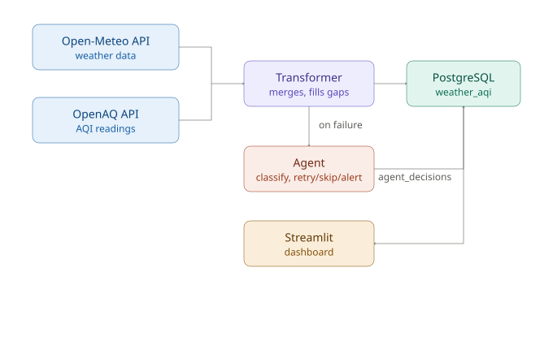

# 🌬️ Windrose

A daily-scheduled data pipeline that pulls weather and air quality data for multiple cities, joins them, and stores the result — orchestrated by Apache Airflow, running fully in Docker. A self-healing agent monitors failures and decides how to respond automatically.

## 🔧 What it does

Every day, the pipeline:
1. Fetches current weather (temperature, humidity, wind speed) for a list of cities from **Open-Meteo**
2. Fetches current air quality readings (PM2.5 and other available pollutants) for the same cities from **OpenAQ**
3. Merges both into a single clean record per city
4. Loads it into a PostgreSQL table, building a historical dataset over time

Not every city has an active, recently-reporting AQI sensor nearby — AQI sensor coverage is genuinely sparse in the real world. The pipeline detects this (checking nearby stations by distance, filtering out stale readings older than 48 hours) and records `aqi_available: false` rather than failing, so the pipeline stays useful even with incomplete source data.

## 🤔 Why Airflow

Two independent data sources, each capable of failing separately, feeding into one output. Airflow gives per-source retry handling, a fan-in dependency (load only proceeds once both fetches for a city are handled), and daily scheduling with run history — without needing to hand-roll that logic in a cron script.

## 🩹 Self-Healing Agent

The base pipeline caught failures in a fixed `try/except` per city — if something failed, it just got logged and skipped. No judgment about *what kind* of failure it was or what the right response should be.

**Why not just add more `if/elif` rules?** Hardcoding a rule for every possible error type doesn't scale — you'll always miss cases you didn't think of in advance.

So a lightweight agent sits on top of the pipeline and reasons about each error instead:

1. **Rule-based first** (`classify_error()`) — matches known patterns (timeout/connection → retry, 404 → skip). Instant, free, no API cost.
2. **LLM fallback only when needed** — Gemini is called only if the rule-based check can't classify the error. Calling an LLM for every single failure would waste cost and add latency for no benefit.
3. **Bounded action space** — the agent can only choose `retry`, `skip`, or `alert`. Nothing riskier. If the LLM's response is unparseable or the API call fails, it safely defaults to `alert` instead of guessing.
4. **Persistence** — every decision is logged to an `agent_decisions` table in Postgres, giving a full audit trail of what happened and why.
5. **Dashboard** — a Streamlit app visualizes both the pipeline data and the agent's decisions.

This is the full agent loop — **perceive** (catch the failure) → **reason** (rule or LLM) → **act** (retry/skip/alert) → **persist** (Postgres) → **visualize** (Streamlit) — not just an LLM wrapper.

## 🏗️ Architecture



- **Extractors** (`src/windrose/extractors/`) — one per data source, each with retry-with-backoff and fail-fast validation on bad input
- **Transformer** (`src/windrose/transformer.py`) — merges both extractor outputs into a fixed-schema row, filling missing pollutants with `None`
- **Loader** (`src/windrose/loader.py`) — writes the row into Postgres via a dynamically-built `INSERT`, and persists agent decisions
- **Pipeline** (`src/windrose/pipeline.py`) — orchestrates the above across a config-driven list of cities, with per-city fault isolation (one city failing doesn't block the rest)
- **Agent** (`src/windrose/agent.py`) — classifies failures and decides retry/skip/alert
- **DAG** (`dags/windrose_dag.py`) — thin Airflow wrapper, schedules `Pipeline.run()` daily and routes failures to the agent

## 🐳 Infrastructure

- **Docker Compose**, running Airflow (LocalExecutor — apiserver, scheduler, dag-processor, triggerer) plus two separate Postgres instances: one for Airflow's own internal metadata, one (`postgres-windrose`) for the actual pipeline data
- LocalExecutor was chosen over CeleryExecutor since this runs on a single machine with no need for a distributed task queue
- Secrets (Fernet key, OpenAQ API key, Gemini API key, DB credentials) are kept in a gitignored `.env` file, never committed

## 🚀 Setup

```bash
git clone <repo-url>
cd windrose
# create .env with AIRFLOW_UID, FERNET_KEY, OPENAQ_API_KEY, GEMINI_API_KEY (see .env.example)
docker compose up airflow-init
docker compose up -d
```

Airflow UI: `http://localhost:8080` (default: `airflow` / `airflow`)

To view the dashboard locally:
```bash
python3 -m venv venv
source venv/bin/activate
pip install streamlit
streamlit run dashboard.py
```

## 🛠️ Tech stack

Python · Apache Airflow 3.3 (TaskFlow API) · PostgreSQL · Docker Compose · psycopg2 · Open-Meteo API · OpenAQ API · Google Gemini API · Streamlit · python-dotenv

## 📝 Notes

- City list lives in `src/windrose/config.py`, easy to extend without touching pipeline logic — adding more cities requires zero code changes